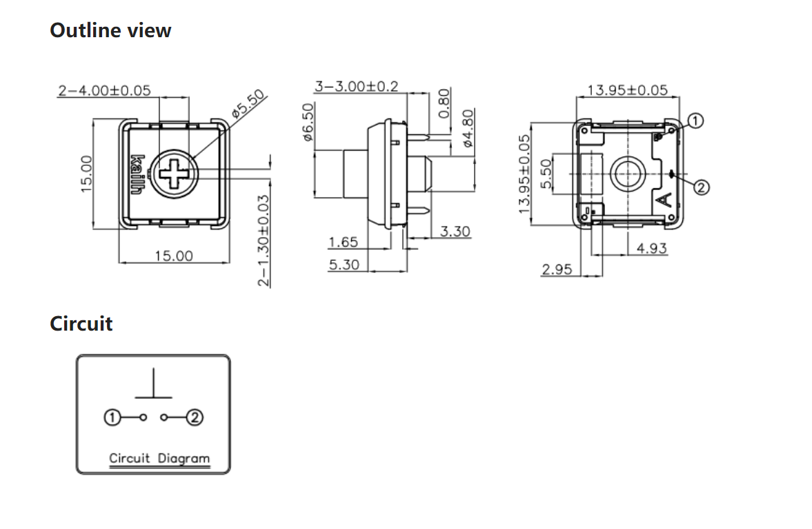

# pro micro

## ピン 説明

|page|map|
|-|-|
|<https://golem.hu/article/pro-micro-pinout/>|<https://geekhack.org/index.php?topic=102327.0>  <https://deskthority.net/wiki/Arduino_Pro_Micro#Pinout>|
|||

# joystick

<https://docs.qmk.fm/#/feature_joystick>

## ソフト
<https://github.com/qmk/qmk_firmware/blob/9dea6f772077dc5c09daf40378e45884d29ab2e2/keyboards/handwired/onekey/keymaps/joystick/keymap.c>

# choc

仕様。
<http://www.kailh.com/en/Products/Ks/CS/755.html>

いつものロープロ
<http://www.kailh.com/en/Products/Ks/CS/321.html>
