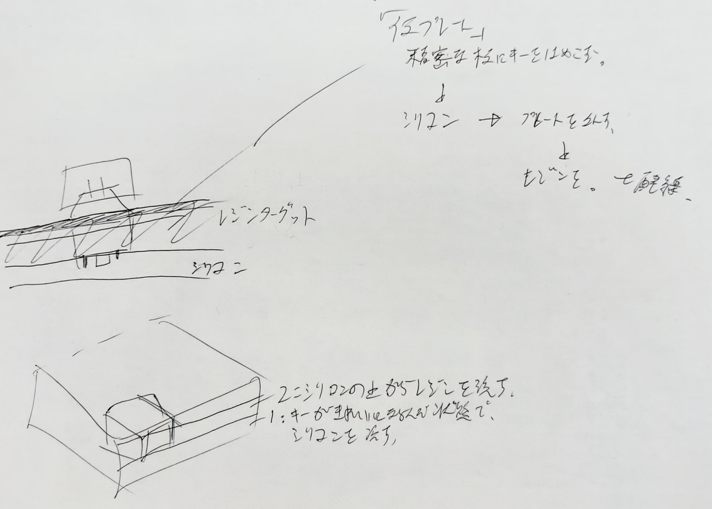

# フレームの作成

フレームは本来であれば、
+ 3dプリンタ
+ pcb
+ アクリルプレート

などを使用して作成するのが主流のようだが、
部屋が狭いので機材はおけない。
意外と高く付くので、外注もめんどくさい。

3dプリンターの外注も高いし。

## 条件

+ スイッチの均等な配置
+ スイッチの水平な配置
+ 十分な強度を持つフレーム

## 考察

材質はレジンでいいと思うんだが、
土台になるものの用意が難しいという問題がある。

平坦でレジンとくっつかない素材を使用したあとに、レジンを流して
整形するのがベースの方法に考える。

そうなるとベースはシリコンモールドになってくるわけだ。

そのためには、まずシリコンを流し込む環境を作成しないといけないし、
その際も平坦にする必要あり。

↓

## 結論1

