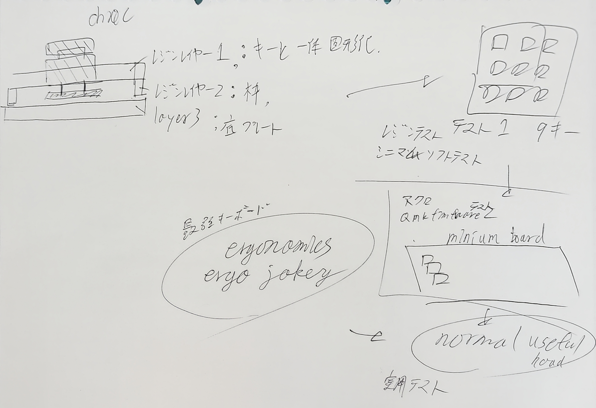

# fullmadeKeyboards

最大限自作でキーボードを作ろう。
ワイヤー配線の方法も掴んだし、まずはハード側から実際に作成してみようぞ。

## todo

+ レイアウトの設計
+ 道具を買う
+ 配線
+ ソフトの作成
+ デバッグ。
+ 皮の作成

## メインテーマ

表面からは既製品にしか見えない見た目。

裏面から見るとゴリゴリ手作り感のある見た目に。

## 既製品感

手作りできる素材の中で、そこまでコスパがかからずにいい感じにサーフェイス感を出せるのは、
レジンだと思う。個人の経験的に。

というか、この前レジンで色々作ったら、意外とかんたんに表面の感じを帰れることができることがわかったので、
そっちでやってみよう。

硬度も結構すごいし。

表面は不透明なレジン、裏面は透明なレジンで囲もう。問題は、キースイッチと一体化して固めないと多分きれいにならないこと。

### レイアウトの作成

原寸大で2Dレイアウトを作成して印刷できる環境を調査する必要がある。

